# PocketTrade System Flow

This document explains how the PocketTrade mobile app, admin dashboard, backend API, database, file storage, email service, and real-time messaging work together.

It is intended for developers, testers, project reviewers, and anyone who needs to understand the system without reading the entire codebase first.

---

## 1. System Overview

PocketTrade is a used-mobile-phone marketplace with three main parts:

1. **Flutter mobile app** — used by buyers and sellers.
2. **React admin dashboard** — used by administrators to review listings, reports, and users.
3. **NestJS backend API** — handles authentication, listings, messaging, moderation, uploads, and database access.

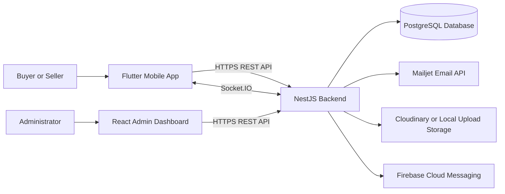

---

## 2. Main Technologies

| Layer | Technology | Purpose |
|---|---|---|
| Mobile frontend | Flutter | Buyer and seller Android application |
| Admin frontend | React + Vite | Browser-based administration panel |
| Backend | NestJS | REST API, authentication, moderation, and business logic |
| Database | PostgreSQL + Prisma | Stores users, listings, messages, reports, and tokens |
| Real-time chat | Socket.IO | Sends and receives messages instantly |
| Email | Mailjet | Sends email OTP codes |
| Images | Cloudinary or local storage | Stores listing and profile images |
| Push notifications | Firebase Cloud Messaging | Sends mobile notifications |
| Deployment | Render | Hosts the backend and database |

---

## 3. Request Flow

Every normal frontend request follows this general path:

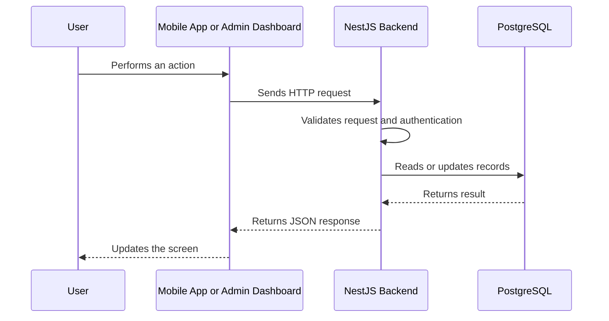

Examples of actions:

- Requesting an OTP
- Logging in
- Searching for phones
- Creating a listing
- Approving a listing
- Sending a report
- Loading conversations

---

## 4. Authentication Flow

PocketTrade uses **email OTP authentication**. A phone number is not required.

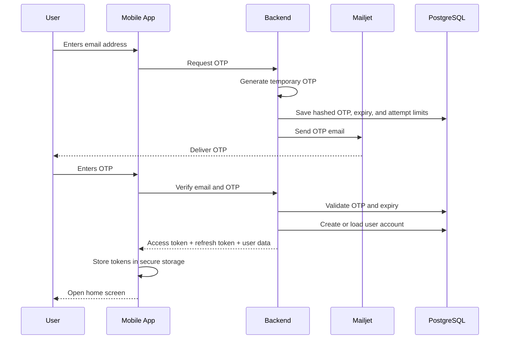

### Authentication rules

- OTP codes expire after a limited time.
- Resend requests have a cooldown.
- Verification attempts are limited.
- Access tokens are required for protected endpoints.
- Refresh tokens are rotated when refreshed.
- Suspended or deleted users are rejected even if an older token exists.
- API secrets remain only in the backend and must never be included in Flutter or React code.

---

## 5. Mobile App Navigation

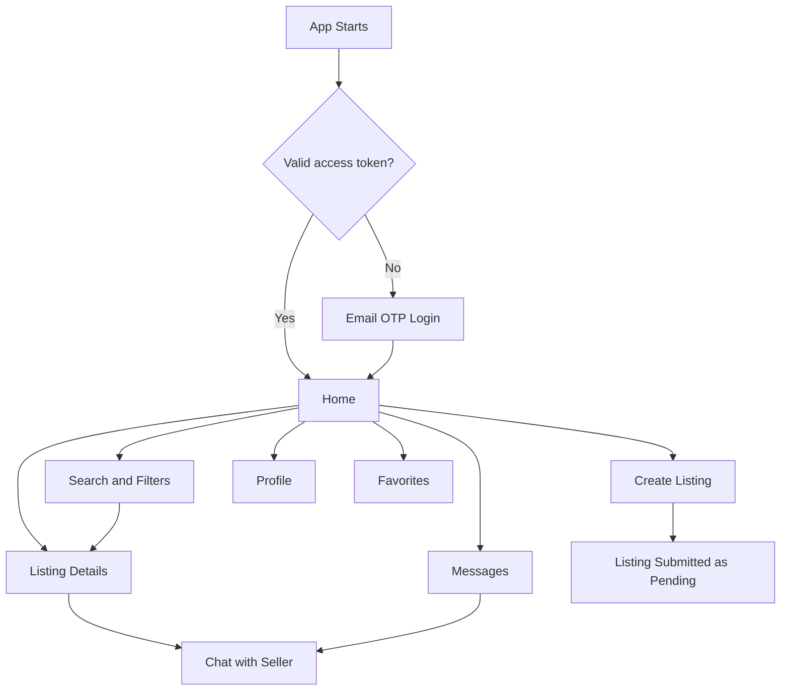

The bottom navigation contains:

- Home
- Search
- Sell
- Messages
- Profile

---

## 6. Listing Creation and Approval Flow

A seller cannot publish a listing directly to the public marketplace. Every new or edited listing must pass administrator review.

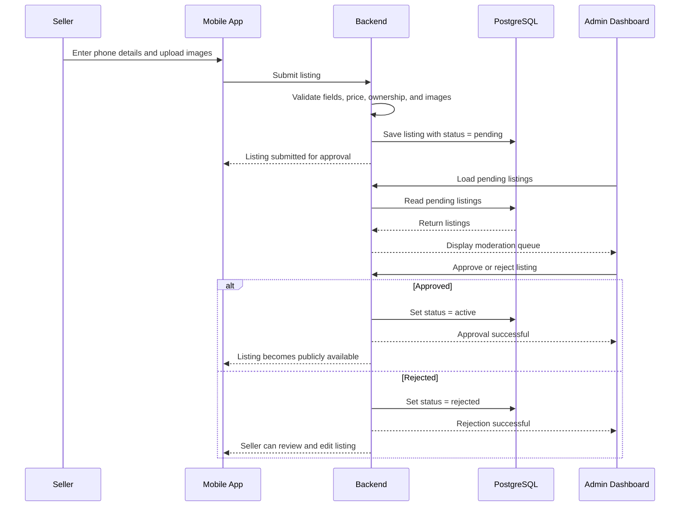

### Listing statuses

| Status | Meaning |
|---|---|
| `pending` | Waiting for administrator review |
| `active` | Approved and visible publicly |
| `rejected` | Rejected by an administrator |
| `sold` | Seller marked the phone as sold |
| `archived` | Listing is no longer publicly shown |

### Public visibility rule

Only approved public statuses such as `active` and `sold` may be returned by public listing endpoints. Pending or rejected listings must not appear in public search or public listing details.

---

## 7. Listing Search Flow

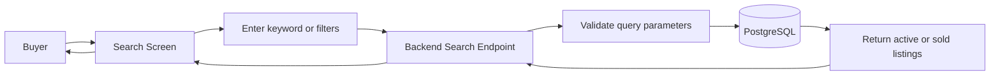

Available filters may include:

- Brand
- Model
- Minimum and maximum price
- Location
- Condition
- Search keyword

The backend must apply visibility rules. The mobile app must not be trusted to hide restricted records by itself.

---

## 8. Listing Details Flow

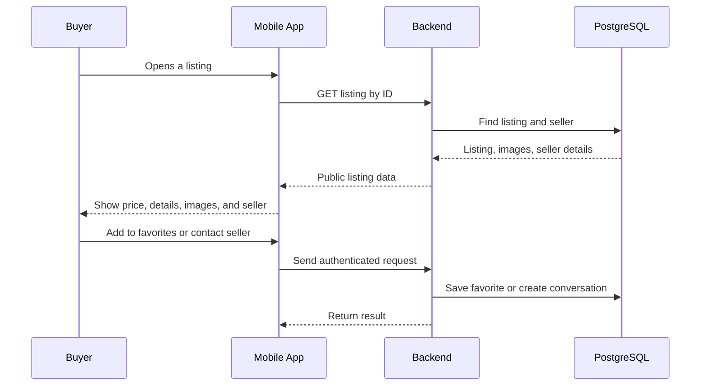

Private information such as personal phone numbers and private email addresses should not be exposed on listing pages.

---

## 9. Messaging Flow

PocketTrade uses both REST endpoints and Socket.IO.

- REST is used to load conversations and message history.
- Socket.IO is used for real-time message delivery.

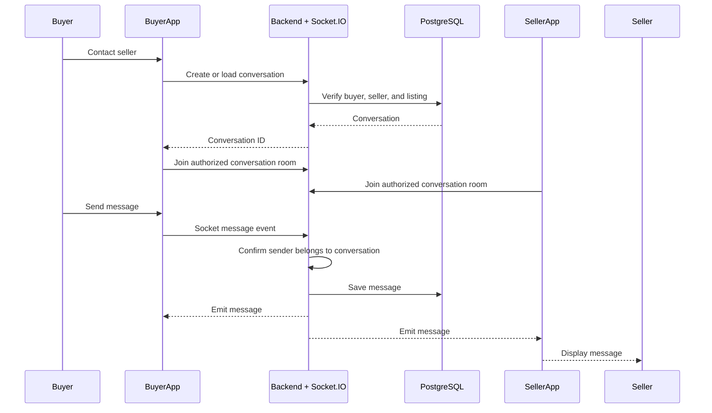

### Messaging security

- Users may only join conversations they belong to.
- The backend verifies membership before joining a Socket.IO room.
- Messages are stored in the database.
- Email addresses and phone numbers do not need to be exposed.
- Blocking or suspension should prevent continued access where applicable.

---

## 10. Favorites Flow

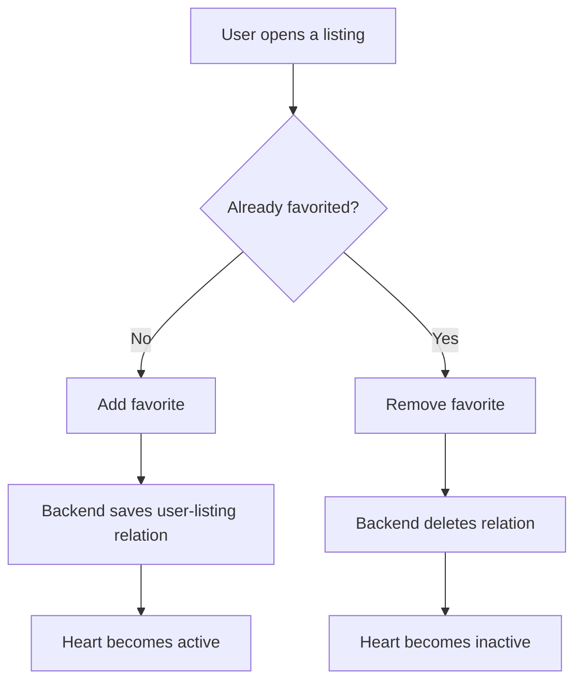

Favorites are linked to the authenticated user and listing ID.

---

## 11. Reporting Flow

Users can report suspicious or inappropriate listings.

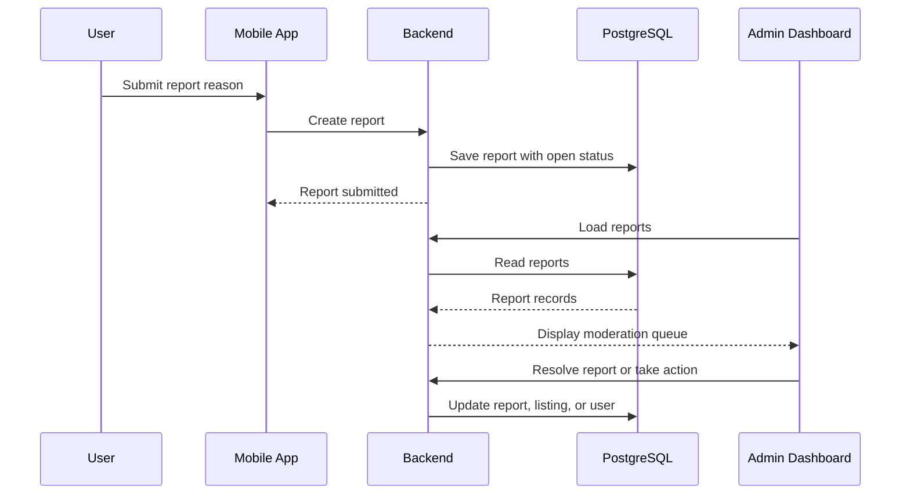

Administrators may:

- Resolve or dismiss reports
- Remove or reject listings
- Suspend abusive users
- Review related listing and account information

---

## 12. Admin Dashboard Flow

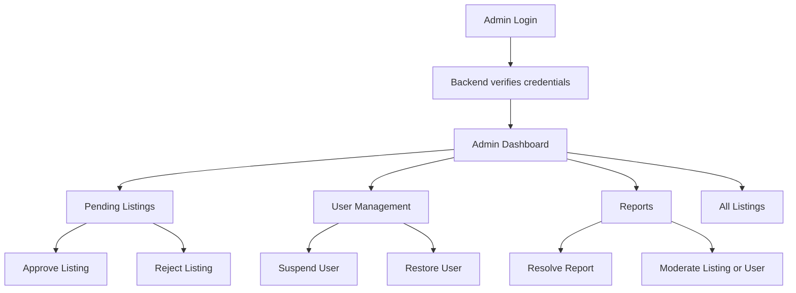

Admin authorization is enforced by backend role guards. Hiding an admin button in the React frontend is not sufficient protection.

---

## 13. Image Upload Flow

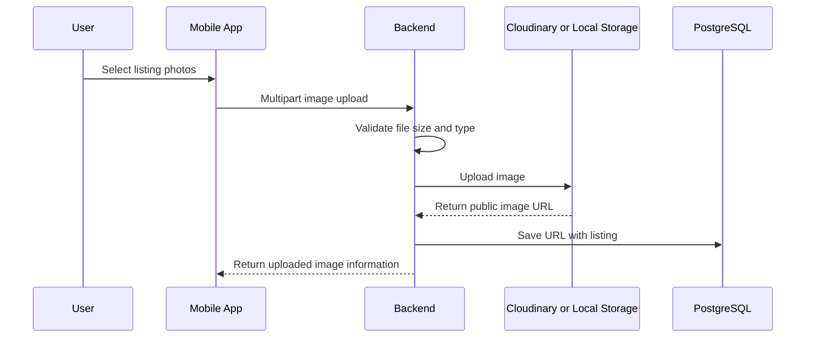

Image validation should include:

- Accepted MIME types
- Maximum file size
- Maximum number of images
- Authentication and listing ownership
- Safe file naming

For production, Cloudinary or another dedicated object-storage service is safer than relying on temporary local filesystem storage.

---

## 14. Push Notification Flow

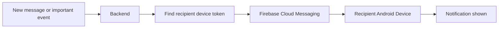

Push notifications are separate from Socket.IO:

- Socket.IO works while the app is connected.
- Firebase notifications can notify the user while the app is in the background or closed.

---

## 15. Database Relationships

The exact Prisma schema is the source of truth, but the system can be understood through these main relationships:

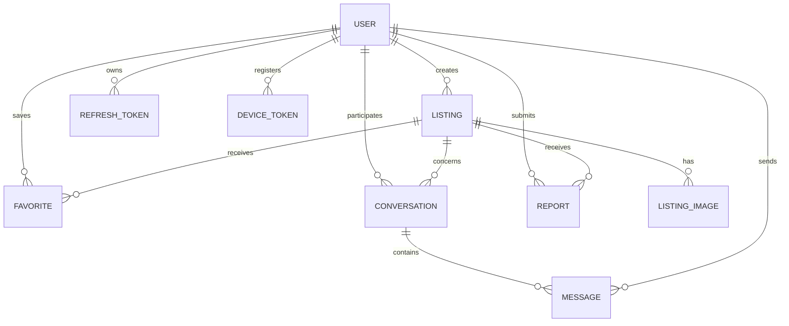

### Main stored entities

- User
- Listing
- Listing image
- Favorite
- Conversation
- Message
- Report
- OTP record
- Refresh or revoked token record
- Device notification token

---

## 16. Backend Module Responsibilities

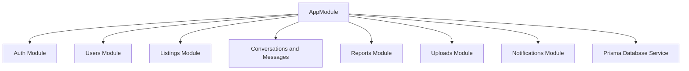

| Module | Responsibility |
|---|---|
| Auth | OTP requests, verification, JWT, refresh tokens |
| Users | Profiles, account state, administration |
| Listings | Create, edit, search, moderation, ownership |
| Conversations | Create and load buyer-seller conversations |
| Messages | Store and deliver chat messages |
| Reports | User reports and admin resolution |
| Uploads | Image validation and storage |
| Notifications | Firebase device tokens and push messages |
| Prisma | Database access shared by backend services |

---

## 17. Backend Security Layers

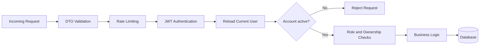

Important controls:

- Request DTO validation
- Rate limiting for OTP and authentication
- JWT verification
- Current account status check
- Role checks for administrator endpoints
- Ownership checks for seller actions
- Conversation membership checks
- Listing visibility checks
- Secure secret management through environment variables
- Restricted CORS configuration in production

---

## 18. Environment Variables

The backend receives configuration through environment variables. Exact names may vary by implementation, but the categories include:

```env
DATABASE_URL=
JWT_SECRET=
JWT_REFRESH_SECRET=
CORS_ORIGINS=

MAILJET_API_KEY=
MAILJET_API_SECRET=
MAILJET_FROM_EMAIL=
MAILJET_FROM_NAME=PocketTrade

CLOUDINARY_CLOUD_NAME=
CLOUDINARY_API_KEY=
CLOUDINARY_API_SECRET=

FIREBASE_PROJECT_ID=
FIREBASE_CLIENT_EMAIL=
FIREBASE_PRIVATE_KEY=
```

Rules:

- Never commit real secrets to GitHub.
- Never place backend API secrets in Flutter or React source code.
- Use Render environment variables for production.
- Use a local `.env` file for development and keep it ignored by Git.

---

## 19. Deployment Flow

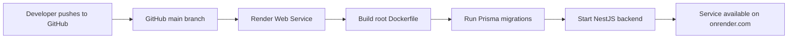

Current backend deployment expects:

- Repository root as Docker build context
- Root `Dockerfile`
- PostgreSQL `DATABASE_URL`
- Required authentication and email environment variables
- Render-provided `PORT`

The backend reads `PORT` from the environment and falls back to port `3000` locally.

---

## 20. Android Development Connection

When running the backend on the same Windows computer as the Android emulator:

```text
Android emulator API URL: http://10.0.2.2:3000
Windows browser API URL:  http://localhost:3000
```

`localhost` inside the Android emulator points to the emulator itself. `10.0.2.2` is the emulator address for the host computer.

For a physical phone on the same Wi-Fi network, use the computer's local IPv4 address:

```text
http://YOUR-PC-IP:3000
```

---

## 21. Typical Buyer Journey

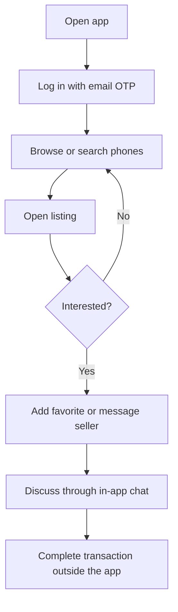

---

## 22. Typical Seller Journey

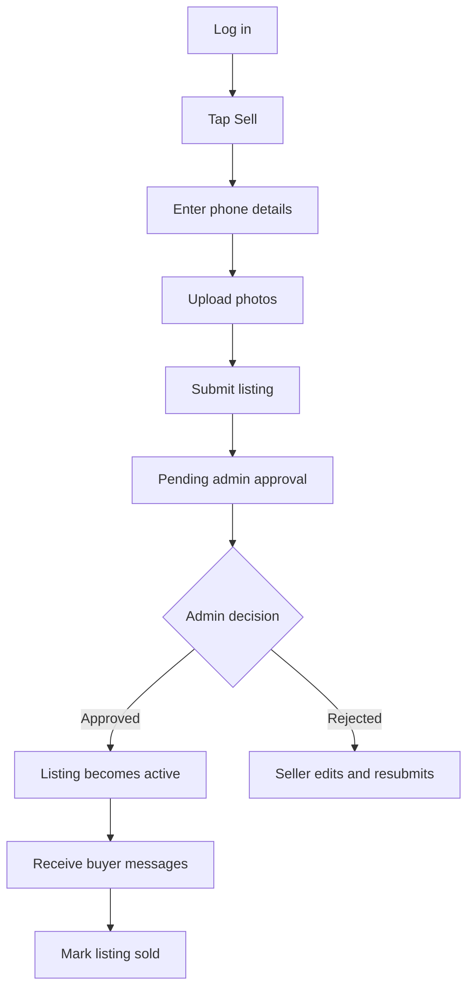

---

## 23. Typical Administrator Journey

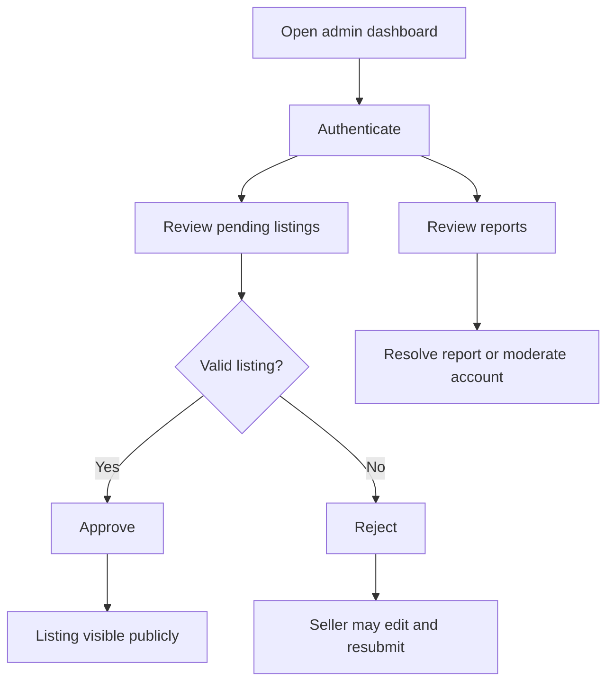

---

## 24. Error Handling Flow

```mermaid
flowchart TD
    Request[Frontend sends request] --> API[Backend]
    API --> Check{Successful?}
    Check -- Yes --> Success[Return expected JSON]
    Check -- No --> Filter[Global exception filter]
    Filter --> Response[Return consistent error response]
    Response --> Frontend[Show user-friendly message]
```

The frontend should handle:

- No internet connection
- Backend unavailable or sleeping
- Invalid or expired OTP
- Expired access token
- Unauthorized or forbidden request
- Invalid listing data
- Upload failure
- Empty results
- Server validation errors

---

## 25. Quick Summary

PocketTrade follows this core pattern:

```mermaid
flowchart LR
    Person[User or Admin] --> Interface[Flutter App or React Dashboard]
    Interface --> Backend[NestJS API]
    Backend --> Database[(PostgreSQL)]
    Backend --> External[Mailjet, Cloudinary, Firebase]
    Backend --> Interface
    Interface --> Person
```

The frontend is responsible for displaying information and collecting input.

The backend is responsible for security, validation, permissions, moderation, and business rules.

The database is the permanent source of application data.

External services handle email delivery, image storage, and push notifications.

---

## 26. Source-of-Truth Files

When implementation details differ from this overview, check these areas in the repository:

```text
backend/src/                 NestJS modules, controllers, and services
backend/prisma/schema.prisma Database models and relationships
backend/prisma/migrations/   Database migration history
mobile/lib/                  Flutter screens, models, API calls, and routing
admin/src/                   React dashboard pages and API calls
Dockerfile                   Production backend image
.env.example                 Required configuration names
```

Update this document whenever a major authentication, listing, moderation, messaging, or deployment flow changes.
